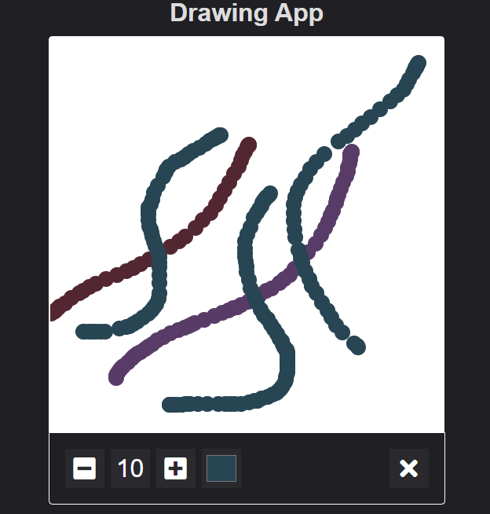

<h1 style="text-align:center;">DrawingApp</h1>

<h2>Tecnologias usadas: 👨‍💻</h2>

<ul>
  <li>HTML</li>
  <li>CSS</li>
  <li>Javascript</li>
</ul>

Desenvolvido por <a href="https://github.com/Wiuver-Ribeiro">Wiuver Ribeiro</a> &copy;

